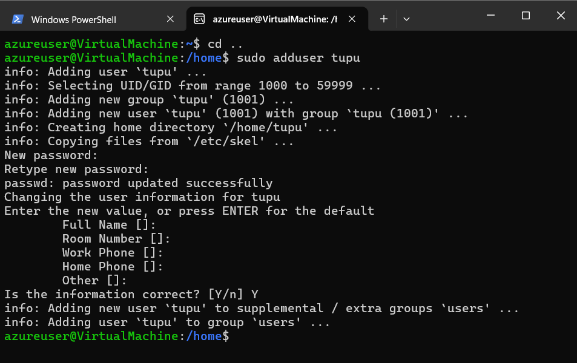
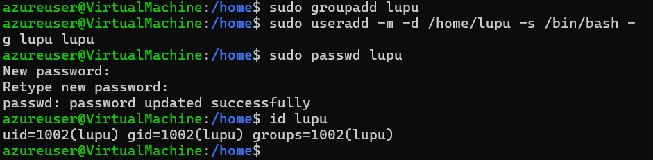
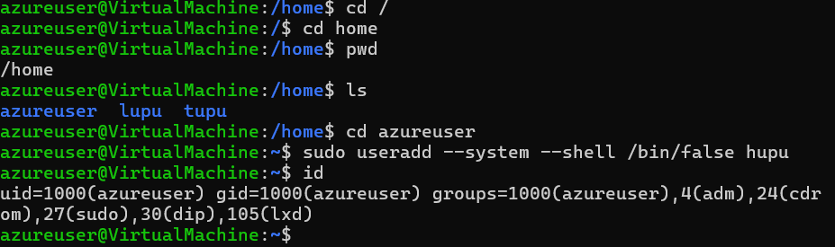
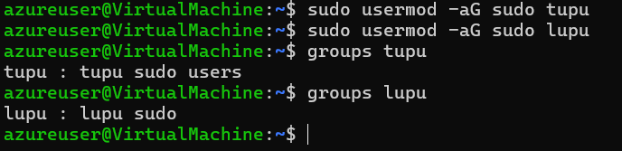
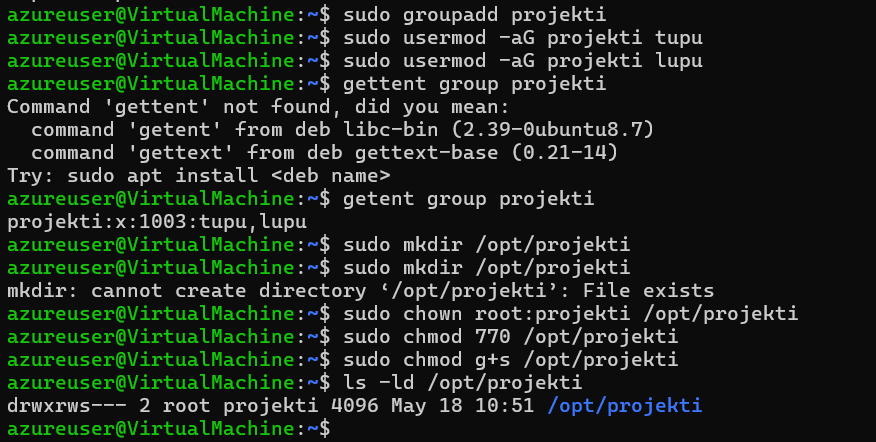

# Assigment 3
For `Assignment 3` the task was to create users and use created users to test out file access permissions.
# Linux User and Permission Management Lab Report

## Step 1: Provisioning the 'tupu' User via `adduser`
The first objective required creating a standard user account named `tupu`. For this, the high-level `adduser` interactive script was utilized, which automatically handles home directory creation and default shell assignment.

```bash
sudo adduser tupu
```
**Image**


## Step 2: Provisioning the 'lupu' User via useradd
The next objective was to replicate a similar user profile, home directory, and group structure for a new user named lupu, but specifically using the low-level useradd utility.

During the initial configuration, attempting to assign a secondary group immediately via -G lupu threw an error because the group did not yet exist:
```
useradd: group 'lupu' does not exist
```
To resolve this and accurately mimic the behavior of the adduser script (which creates a primary group matching the username), the group was manually initialized first. The -g flag was then used to define it as the primary group, alongside the explicit flags for directory creation and shell definition:

```bash
sudo groupadd lupu
```
```bash
sudo useradd -m -d /home/lupu -s /bin/bash -g lupu lupu
```

**Image**



## Step 3: Configuring the 'hupu' System Account
A system-specific user named hupu was required for non-interactive processes. To ensure security, the account was provisioned without a valid login shell, routing any login attempts directly to /bin/false.
```bash
sudo useradd --system --shell /bin/false hupu
```
**Image**



## Step 4: Granting Administrative Privileges
To provide tupu and lupu with administrative (sudo) capabilities, two standard administrative approaches were considered:

Approach 1: Direct modification of the sudoers configuration file via the **sudo visudo** command by appending:
```bash
sudo visudo
```
- After this:
```
Add the following lines:
tupu ALL=(ALL:ALL) ALL
lupu ALL=(ALL:ALL) ALL
```
- Approach 2: Appending the users directly to the pre-existing system sudo group.

The second approach was chosen for its clean implementation and ease of management:
```bash
sudo usermod -aG sudo tupu
sudo usermod -aG sudo lupu
```

**Images**



## Shared Directory Setup and Permission Controls
The final administrative task involved creating a shared directory at /opt/projekti. The access constraints dictated that only tupu and lupu should have the rights to view, read, and modify assets within this location.

To achieve this without compromising security, a dedicated collaboration group was established:
```bash
sudo groupadd projekti
```
And added both users to the group:
```bash
sudo usermod -aG projekti tupu
sudo usermod -aG projekti lupu
```
Next, the target directory was generated, ownership was assigned to the new group, and strict read/write/execute permissions (**770**) were applied. This ensures that the root user and group members hold full access, while unauthorized external accounts are completely blocked. Additionally, the setgid bit (**g+s**) was enforced so that any files subsequently generated inside this directory automatically inherit the projekti group ownership.
```bash
sudo mkdir /opt/projekti
```
Then, I assign group ownership:
```bash
sudo chown root:projekti /opt/projekti
```
After doing so, I set the directory permissions.
```bash
sudo chmod 770 /opt/projekti
```
With this:
- Owner and Groups can read, write, execute.
-Others they have no access.

After this, setgid bit ensures all newly created files and directories inherit the ``projekti`` group.
```bash
sudo chmod g+s /opt/projekti
```

**Images**



## Step 6: Empirical Verification of Permissions
To validate that the isolation and collaboration parameters function as intended, access testing was conducted across the different user accounts.

- Scenario A: Verification via ``tupu``
Switching to the tupu environment confirmed full access to the workspace, including directory navigation and successful file generation.

```bash
su - tupu
cd /opt/projekti
touch test_tupup.txt
ls -l
```
**Image**


- Scenario B: Verification via ``lupu``
Switching to the lupu environment confirmed that group-level collaboration works flawlessly. The user successfully appended data to tupu's file and generated their own assets, which correctly inherited the projekti group ID due to the setgid configuration.
```bash
su - lupu
cd /opt/projekti
echo "hello" >> test_tupu.txt
touch test_lupu.txt
ls -l
```
**Images**


Scenario C: Boundary Verification via ``hupu``
Because hupu lacks a login shell, attempting an interactive su - hupu session behaves exactly as expected for a locked system account. Furthermore, as an unprivileged "other" user relative to the target directory, any direct access attempts to the restricted path are cleanly blocked by the operating system kernel.

Here hupu is a unauthorized access so it should so access denied.

```bash
su - hupu
cd /opy/projekti
```

**Images**


The contrasting outcomes between authorized users (tupu/lupu) and the unauthorized system account (hupu) demonstrate that the permission matrix is working perfectly.

# Conclusion
This assignment provided practical insight into the underlying mechanics of Linux user provisioning, administrative escalation paths, and group-based access control lists (ACLs). Correctly utilizing primary vs. secondary groups, alongside special directory flags like setgid, highlights how modern multi-user operating systems isolate and secure environments effectively.
