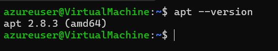
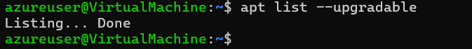
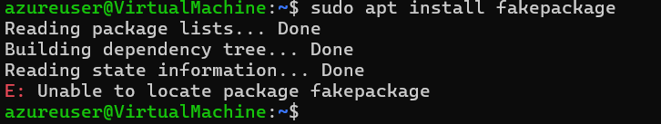

# Assignment 6: Mastering APT (Advanced Package Tool)

**Objectives:**
- Learn how to install, update, remove, and search for packages using APT
- Understand repositories and how package dependencies work
- Get practical experience troubleshooting common package issues

## Part 1: Getting Started with APT and System Updates

### 1. Check Your APT Version

```bash
apt --version
   ```
✅ Gain hands-on experience in troubleshooting package installation issues.

**Images:**



## Explanation:
This command displays the currently installed version of APT. APT is the powerful package manager used by Ubuntu and other Debian-based Linux distributions.

```2. Update the package list```

```bash
sudo apt update
```
What it does:

- Refreshes the list of available packages from your configured repositories
- Updates metadata and version information
- Does not upgrade or install any software

```3. Upgrade install package```

```bash
sudo apt upgrade -y
```

#### Difference between ```update``` and ```upgrade```
| Command       | What It Does               |
| ------------- | -------------------------- |
| `apt update`  | Refreshes package list     |
| `apt upgrade` | Installs available updates |


Simple: 
- ```update``` = check
- ```upgrade```= install

```4.View Pending Updates``` 
```bash
apt list --upgradable 
```
**Images:**



This shows all installed packages that have newer versions ready to install.

## Second part: Installing & Managing Packages 
``1. Search for an Image Editor``

```bash
apt search image editor
```
**Selected Package:**
``gimp``

``2. View Package Details``
```bash 
apt show gimp
```

**Dependencies require:**

GIMP requires multiple system libraries and image-processing libraries such as:

- libgimp2.0t64

- gimp-data

- libc6

- libgtk2.0-0t64

- libpng16-16t64

- libjpeg8

- libtiff6

- libwebp7

- zlib1g

- graphviz

- xdg-utils

These dependencies are necessary for graphical rendering, image decoding, file format support, and system integration.

``3. Install the Package``

```bash
sudo apt install gimp -y
```
It is instlled.
**Result:** 
```bash
gimp --version
```
**GNU Image Manipulation Program version 2.10.36**

``4. Check installed package version:``

```bash
apt list --installed | grep gimp 
```
**Result:** 
```bash
gimp/noble-updates,now 2.10.36-3ubuntu0.24.04.1 amd64 [installed]
```
``Additional Installed Packages:``

You'll also notice that APT automatically installed required dependencies like ``gimp-data`` and ``libgimp2.0t64.``

## Third part: Removing & Cleaning Packages
``1. Remove Package ``
```bash 
sudo apt remove gimp -y
```

- This removes the program but keeps configuration files.

``2. Purge Configuration Files``
```bash 
sudo apt remove gimp -y
```
- Difference Between Remove and Purge

| Command | What It Removes               |
| ------- | ----------------------------- |
| remove  | Program files only            |
| purge   | Program + configuration files |

``3. Remove Unused Dependencies``

```bash 
sudo apt autoremove -y
```
Why this matters:
When you install software, APT pulls in dependencies. After removing the main package, these libraries often stay behind. ``autoremove`` cleans them up and frees disk space.

``4. Clean Downloaded Package Files``

```bash 
sudo apt clean
```
- ``apt clean`` deletes those cached files.
This removes downloaded ``.deb`` files from the local cache, helping keep your system tidy.

## Fourth Part : Managing Repositories & Troubleshooting

`` 1. List APT Repositories``
```bash 
cat /etc/apt/sources.list
```
 This means that in Ubuntu 24.04 (noble), the traditional sources.list file is no longer used to manage repositories. Ubuntu now uses the newer deb822 format, where repository configurations are stored inside the /etc/apt/sources.list.d/ directory.

Therefore, repository management has shifted from the old flat text format to a more structured and modern configuration system.

``2. Add Universe Repository``

```bash
sudo add-apt-repository universe
```
The Universe repository contains thousands of community-maintained open-source applications and libraries (including many popular tools like GIMP).

``3. Simulate Installation Failure``  
```bash
sudo apt install fakepackage
```
**Error Message:**
E: Unable to locate package fakepackage

**Images:**



```How to Troubleshoot```- Check spelling:
```bash
apt search fakepackage
```
- Update package list:
```bash
sudo apt update
``` 
- Verify repositories:
```baash
cat /etc/apt/sources.list
```
- Check internet connection

# Bonus: Holding a Package

- Hold a Package
```bash
sudo apt-mark hold gimp
```
Result:
gimp set on hold.

- Unhold a Package
```bash
sudo apt-mark unhold gimp
```
Common reasons to hold a package:

- A new version breaks your workflow
- You're on a production server and need stability
- You prefer a specific tested version
