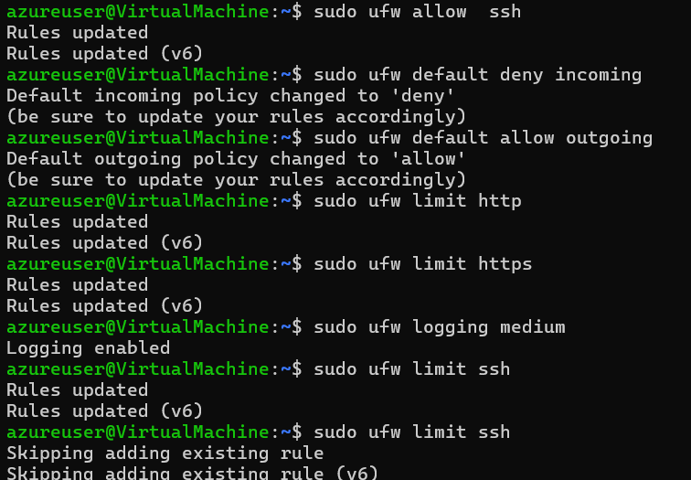
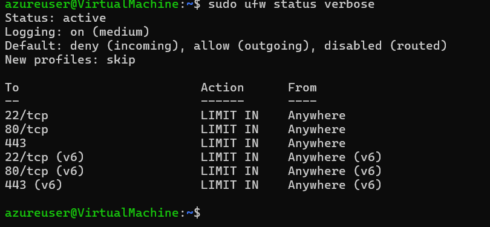

# Assignment 8: Setting Up a Firewall with UFW

**Objective:**  
Configure a host-based firewall using **UFW** (Uncomplicated Firewall) that automatically starts with the server and secures it against unauthorized access.

---

## Firewall Overview

I used **UFW** as the firewall solution for this server. UFW is a user-friendly front-end for `iptables` and is the recommended firewall tool for Ubuntu servers.

### 1. Set Default Policies

```bash
sudo ufw default deny incoming
```

**Purpose:**
Blocks all incoming traffic by default. This significantly reduces the server's attack surface — only explicitly allowed services can be reached.

---

**Rule:**
```bash
sudo ufw default allow outgoing
```
**Purpose:**
Allows the server to make outbound connections (e.g., for package updates, API calls, or downloading resources).
---

### Allowed Services

#### SSH (Openssh server)
**Rule:**
```bash 
sudo ufw limit ssh
```

**Purpose:**
Purpose:

Allows SSH connections on port 22
The limit option automatically rate-limits connection attempts to protect against brute-force and SYN flood attacks.

#### HTTP Server
**Rule:**
```bash
sudo ufw limit http
```
**Purpose:**
Allows normal web traffic on port 80 (TCP) so users can access the website.
#### HTTPS Server
Rule:
```bash
sudo ufw limit https
```
Purpose:
Enables encrypted web traffic on port 443 (TCP) for secure communication.

## Note: I used allow for HTTP/HTTPS because web servers are expected to handle high traffic. SSH uses limit for better security.
--- 

## Logging Configuration

**Rule:**
```bash
sudo ufw logging medium
```
**Purpose:**  
Purpose:
- Enables firewall logging at a medium level
- Records blocked packets and new connection attempts
- Helps with monitoring, troubleshooting, and detecting suspicious activity

Logs are stored in:

`/var/log/ufw.log`

## SYN Flood Protection

**Rule:**
```bash
sudo ufw limit ssh
```

**Purpose:**  
- Limits the rate of incoming TCP connection attempts.  
- This helps mitigate SYN flood attacks by preventing excessive half-open TCP connections that could exhaust server resources.


## Additional Attack Mitigation

### SSH Brute Force Protection

**Rule:**
```bash
sudo ufw limit ssh
```

**Purpose:**  
- SYN Flood Protection: Enabled through the limit rule on SSH.
- Brute Force Protection: The rate-limiting on SSH helps prevent repeated login attempts from the same IP address.

## Firewall Status Verification

The firewall status was verified using:

```bash
sudo ufw status verbose
```

The final configuration shows:

Final Configuration Summary:

- Default Incoming: Deny
- Default Outgoing: Allow
- SSH (22): LIMIT
- HTTP (80): ALLOW
- HTTPS (443): ALLOW
- Logging: Enabled (medium)


**Image**




## Assignment Complete!
The server is now protected with a properly configured firewall that starts automatically on boot and follows the principle of least privilege — denying everything by default and only opening necessary ports.
