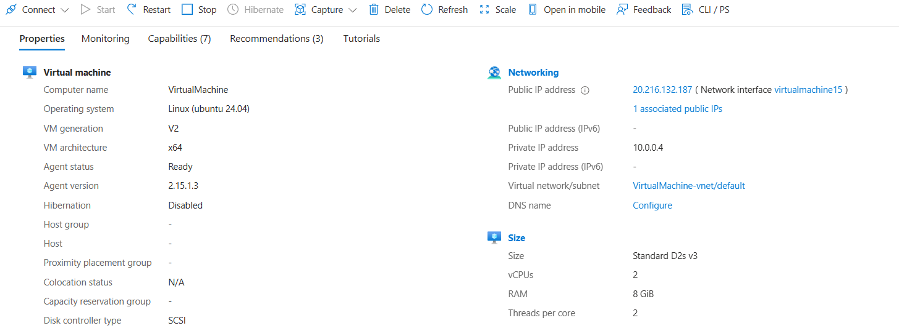
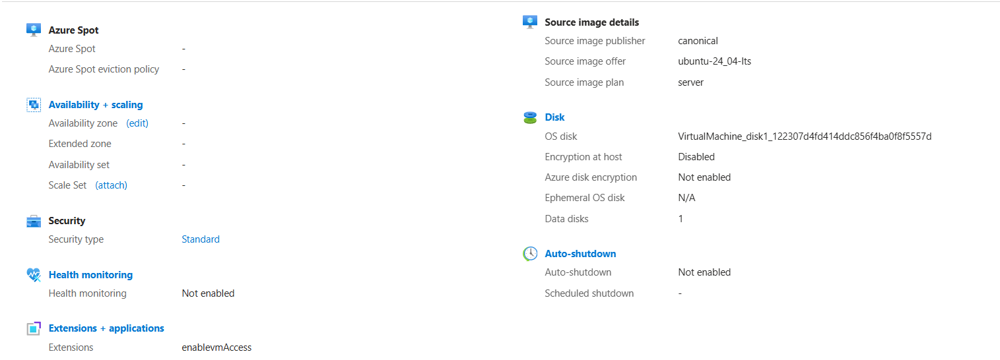

**Name:** Haroon Afridi

**Date:** 18 May 2026  

# Assignment No: 0

# Task 1 – Setting Up an Ubuntu VM on Azure and Connecting via SSH

Here's my straightforward guide on how I created an Ubuntu virtual machine in Microsoft Azure and connected to it using SSH. It was a pretty smooth process overall!

## Step 1: Azure Account and Free Credits

I signed into the [Azure Portal](https://portal.azure.com) using my university email.  
After that, I activated the **Azure for Students** offer, which gave me some free credits to play around with.

## Step 2: Creating a Resource Group

I started by creating a new resource group named `Cloud-Computing-Lab` and placed it in the **West Europe** region for better latency.

## Step 3: Creating the Virtual Machine

These were the main settings I went with:
- **Image**: Ubuntu Server 24.04 LTS
- **Size**: Standard D2s v3 (2 vCPUs, 8 GiB memory)
- **VM Name**: `VirtualMachine`
- **Authentication type**: SSH public key
- **Inbound ports**: Allowed SSH only from my current IP address

There was a short delay because of region capacity, but after a few minutes the VM was successfully deployed.

Here’s a screenshot of the VM overview once it was running:

## Step 4: Connecting with PuTTY

I downloaded PuTTY from the official website. Then I copied the public IP address from the Azure portal, opened PuTTY, entered the IP, my username, and loaded my private SSH key (.ppk file).

The first connection worked right away — I was greeted with the familiar Ubuntu welcome message!

## Step 5: Terminal Access and Shortcuts

Once everything was set up, I configured it so I could quickly connect from the terminal as well (as our professor recommended). I also created a desktop shortcut with the right PuTTY session settings so I can open the VM easily next time without re-entering all the details.

Overall, it was a great hands-on experience with Azure!
